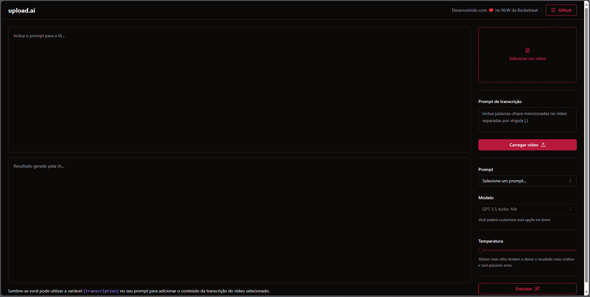

# rocketseat-nlw-ia-mastery

## Rocketseat NLW-IA - Mastery Track

Final Result

<p></p>

<a href="https://drive.google.com/file/d/1HrhU2zLEw8AzeRn9BFptyYqXGcUdT4mg/preview">Video demonstration</a>

## Frontend

Commands executed:

```bash
npm create vite@latest

# create-vite@4.4.1
# Ok to proceed? (y) 
# ✔ Project name: … upload-ai-web
# ✔ Select a framework: › React
# ✔ Select a variant: › TypeScript

cd upload-ai-web/
npm install

npm i -D tailwindcss postcss autoprefixer
npx tailwindcss init -p
npm i -D @types/node
# configure tsconfig.json and vite.config.ts

npx shadcn-ui@latest init

# shadcn-ui@0.3.0
# Ok to proceed? (y) 
# ✔ Would you like to use TypeScript (recommended)? … no / yes
# ✔ Which style would you like to use? › New York
# ✔ Which color would you like to use as base color? › Zinc
# ✔ Where is your global CSS file? … src/index.css
# ✔ Would you like to use CSS variables for colors? … no / yes
# ✔ Where is your tailwind.config.js located? … tailwind.config.js
# ✔ Configure the import alias for components: … @/components
# ✔ Configure the import alias for utils: … @/lib/utils
# ✔ Are you using React Server Components? … no / yes
# ✔ Write configuration to components.json. Proceed? … yes
```

Creating shadcn/ui components:

```bash
npx shadcn-ui@latest add button
npx shadcn-ui@latest add separator
npx shadcn-ui@latest add textarea
npx shadcn-ui@latest add label
npx shadcn-ui@latest add select
npx shadcn-ui@latest add slider
```

<p></p>

## Backend

Commands executed:

```bash
mkdir upload-ai-api
cd upload-ai-api/
npm i -D typescript @types/node tsx
npm i fastify

npm i -D prisma
npx prisma init --datasource-provider sqlite

npx prisma migrate dev

npx prisma studio


npm i @fastify/multipart


npm i zod


npm i openai
npm i -D dotenv


npm i @fastify/cors
```

## Video Processing

```bash
npm i @ffmpeg/ffmpeg @ffmpeg/util
```

## Communication between Frontend and Backend

```
npm i axios
```

## Receiving the openai response asynchronously

```
npm i ai
```

## Populating the database from a seed file

```
npx prisma db seed
```
